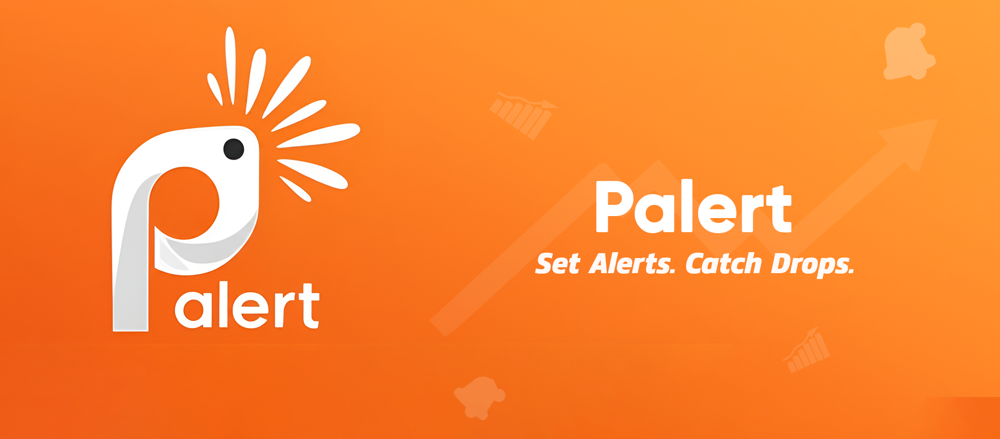
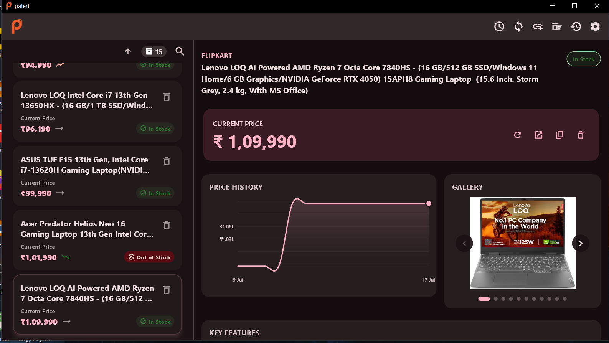
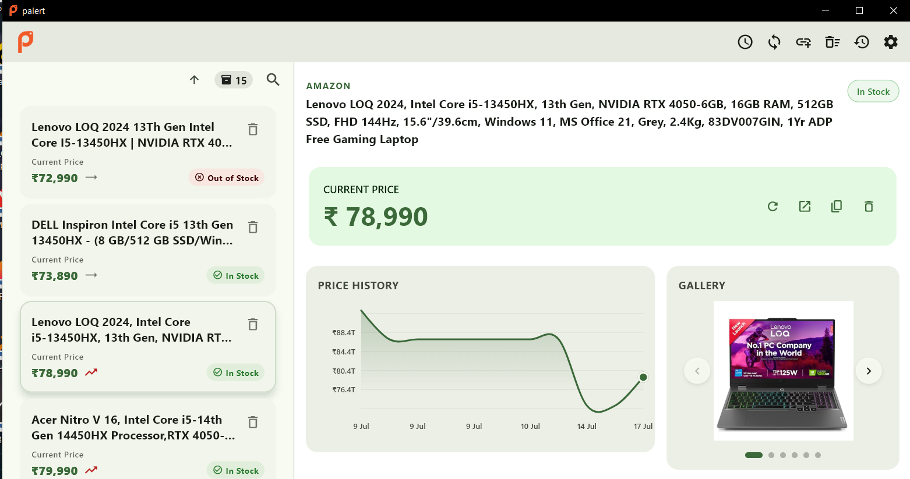
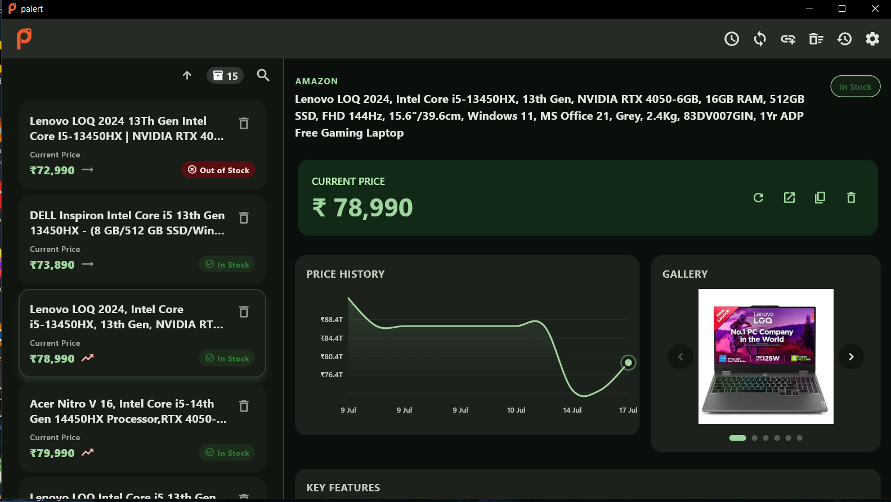
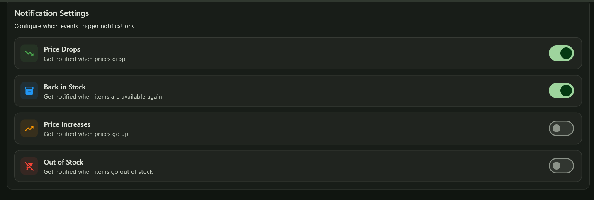
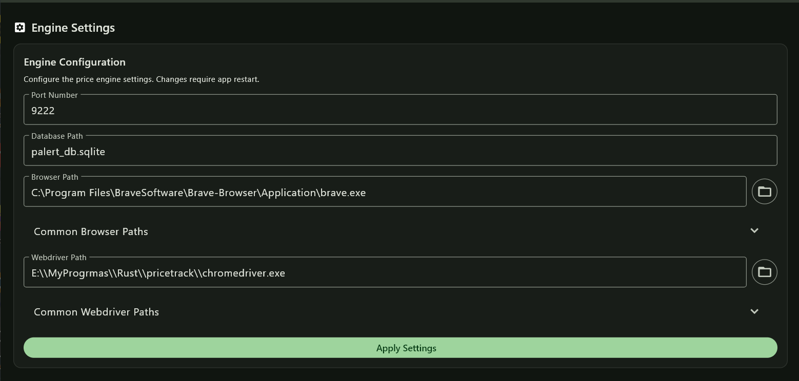

# 🛍️ Palert – Your Personal Price & Stock Tracker

**Palert** is a lightweight, powerful desktop app that helps you **track product prices and stock availability** on **Amazon** and **Flipkart**. Stop checking websites manually and let Palert notify you about the best deals.

  
  

---

## ✨ Features

| 🌟 Feature                 | 💡 Description                                                              |
| -------------------------- | --------------------------------------------------------------------------- |
| 🛒 **Multi-Store Support** | Track products from Amazon & Flipkart in one place.                         |
| 📈 **Price History**       | Visualize price fluctuations with a clean, interactive line chart.          |
| 🖼️ **Product Gallery**     | View all product images directly within the app.                            |
| ⏰ **Auto-Refresh**        | Set a custom interval to automatically check for price and stock changes.   |
| 🧭 **Smart Controls**      | Instantly open product pages, copy links, or remove items.                  |
| 🕶️ **Background Mode**     | Runs silently in the background with minimal resource usage.                |
| 🔔 **Instant Notifications** | Get notified as soon as a price drops or an item is back in stock.          |
| 🔒 **Local & Private**     | All your data is stored securely on your device using SQLite.               |
| 🖥️ **Headless Engine**     | Choose your preferred browser (Chrome, Firefox) for reliable data scraping. |
| ⚡ **Fast & Efficient**    | Built with Rust and Flutter for a native, smooth, and fast experience.      |

---

## 🧠 How It Works

Palert combines a powerful **Rust** backend with a beautiful **Flutter** frontend. It uses a headless browser to intelligently scrape product information directly from websites, ensuring you get real-time data without relying on any third-party APIs. It even handles captchas by mimicking real user behavior.

### 🛠 Requirements

*   🖥️ A supported web browser (e.g., Chrome, Firefox).
*   🛠️ The matching **WebDriver** for your browser (e.g., [ChromeDriver](https://chromedriver.chromium.org/) or [GeckoDriver](https://github.com/mozilla/geckodriver/releases)).

---

## 🚀 Getting Started

1.  📥 **Download** the latest release from the Releases page.
2.  📂 **Place your WebDriver** executable in the required application folder.
3.  ▶️ **Run the app** and add your first product URL from Amazon or Flipkart.
4.  ⏲️ **Set your refresh interval** and let Palert do the rest!

> Palert will now monitor your products in the background. You'll get a notification if anything changes!

---

## 📅 Upcoming Features

*   🌍 **More Platforms**: Support for eBay, Meesho, Ubuy, and other international sites.
*   📧 **Alerts**: Email & SMS notifications for price drops and stock alerts.
*   🐧 **Cross-Platform**: Native support for Linux & macOS.
*   🌐 **Multi-Language**: UI translations for global users.

---

## 👨‍💻 Contribute

Palert is open-source and built with ❤️. Contributions are welcome, especially from developers skilled in **Rust** and **Flutter**. If you find a bug, have a feature request, or want to improve the code, please open an issue or submit a pull request!

---

## 🤖 Why I Made This

I built Palert to solve a personal problem: I was tired of manually checking multiple websites for price drops and stock updates. Existing tools were either too complex or didn't have the features I needed. So, I created my own solution that is simple, powerful, and respects user privacy by keeping all data local.

> You are in complete control of your data.

---

## 📸 Screenshots
image using md format

---

## 📬 Stay Updated

New features are always on the way! ⭐ Star the project on GitHub to show your support and stay tuned for updates. 💚